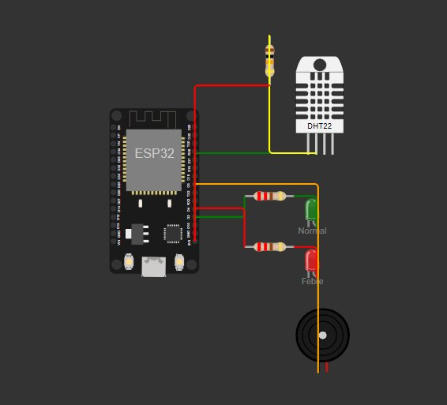
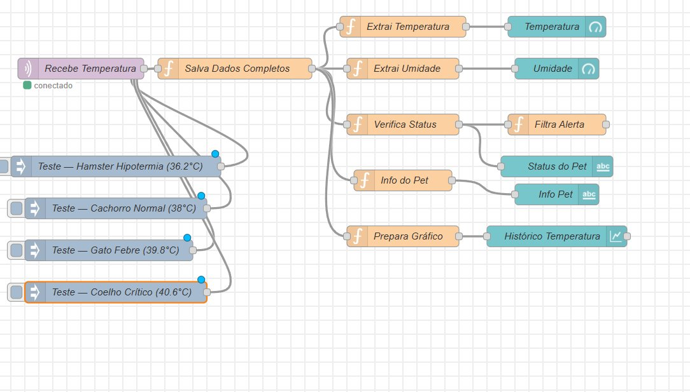
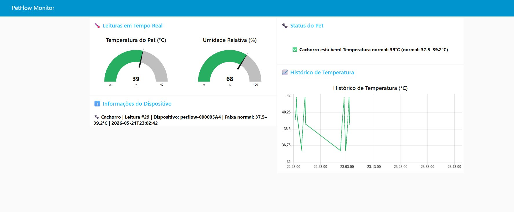

[README.md.md](https://github.com/user-attachments/files/28132287/README.md.md)
# 🐾 PetFlow IoT — Monitor de Temperatura de Pets

> **FIAP 2026 — Disruptive Architectures: IoT, IoB & Generative IA**
> Sprint 1 — Prova de Conceito

---

## 📋 Descrição do Projeto

O **PetFlow IoT** é um sistema de monitoramento de temperatura corporal de pets em tempo real, utilizando tecnologias de Internet das Coisas (IoT). O projeto utiliza um microcontrolador **ESP32** com sensor de temperatura e umidade **DHT22** para capturar leituras periódicas e transmiti-las via protocolo **MQTT** para um dashboard **Node-RED**, onde os dados são visualizados e alertas são disparados de acordo com o estado clínico do animal.

O problema real que o projeto busca resolver é a **dificuldade dos tutores em monitorar continuamente a temperatura corporal de seus pets** — especialmente animais de pequeno porte como hamsters, coelhos e chinchilas, que são sensíveis a variações térmicas e cujos sinais de febre ou hipotermia costumam ser percebidos tarde. O PetFlow oferece monitoramento contínuo e alertas imediatos.

---

## 👥 Equipe

| Nome | RM |
|---|---|
| Lucas Grillo Alcântara | 561413 |
| Pietro Ferreira Gomes Abrahamian | 561469 |
| Pedro Peres Benitez | 561792 |
| Lucca Ramos Mussumecci | 562027 |

---

## 🎬 Demonstração em Vídeo

[](https://www.youtube.com/watch?v=rmfkoSCNASo)

> Clique na imagem para assistir ao vídeo de demonstração no YouTube.

---

## 🎯 Objetivos

### Objetivo Principal
Desenvolver um protótipo funcional simulado que utilize tecnologias de IoT para monitoramento de temperatura corporal de pets, com dashboard em tempo real via protocolo MQTT.

### Objetivos Específicos
- Demonstrar o funcionamento do sensor DHT22 conectado ao ESP32 via Wokwi
- Transmitir dados de temperatura e umidade via MQTT (broker público HiveMQ)
- Exibir os dados em dashboard Node-RED com gauges, gráfico histórico e alertas
- Simular cenários clínicos reais (hipotermia, normal, febre, crítico) com temperaturas biológicas reais por espécie
- Evidenciar a viabilidade técnica do projeto como prova de conceito

---

## 🏗️ Arquitetura do Sistema

```
┌─────────────┐     WiFi      ┌──────────────────┐     MQTT      ┌───────────────────┐
│  ESP32 +    │ ────────────► │  HiveMQ Public   │ ────────────► │  Node-RED         │
│  DHT22      │               │  Broker          │               │  Dashboard        │
│  (Wokwi)    │               │  broker.hivemq   │               │  (UI + Alertas)   │
└─────────────┘               │  .com:1883       │               └───────────────────┘
     │                        └──────────────────┘
     │
     ├── LED Verde  → Status NORMAL
     ├── LED Vermelho → Febre / Hipotermia / Crítico
     └── Buzzer     → Alertas sonoros por severidade
```

**Tópicos MQTT:**
- `petflow/temperatura` — payload JSON com todos os dados da leitura
- `petflow/status` — heartbeat do dispositivo (online/uptime)

---

## 🔧 Tecnologias Utilizadas

| Camada | Tecnologia |
|---|---|
| Hardware (simulado) | ESP32 DevKit V1, DHT22, LEDs, Buzzer, Resistores |
| Simulador | [Wokwi](https://wokwi.com) |
| Firmware | Arduino / C++ (PlatformIO-compatible) |
| Comunicação | MQTT sobre WiFi (TCP/IP) |
| Broker MQTT | HiveMQ Public Broker (`broker.hivemq.com:1883`) |
| Dashboard | Node-RED + node-red-dashboard |
| Serialização | ArduinoJson |
| Sincronização de tempo | NTP (`pool.ntp.org`, GMT-3) |

### Bibliotecas Arduino
```
PubSubClient
DHT sensor library for ESPx (dhtESP32-rmt)
ArduinoJson
WiFi (built-in ESP32)
```

---

## 🔌 Circuito — Pinagem

| Componente | Pino ESP32 | Observação |
|---|---|---|
| DHT22 — DATA | GPIO 15 | Pull-up 10kΩ externo + interno ativado |
| DHT22 — VCC | 3.3V | — |
| DHT22 — GND | GND | — |
| LED Verde (Normal) | GPIO 2 | Resistor 220Ω série |
| LED Vermelho (Febre) | GPIO 4 | Resistor 220Ω série |
| Buzzer | GPIO 5 | Ativo direto |



> Circuito simulado no Wokwi: ESP32 conectado ao DHT22 (GPIO 15), LED Verde/Normal (GPIO 2), LED Vermelho/Febre (GPIO 4) e Buzzer (GPIO 5).

---

## 🌡️ Lógica de Status Clínico

O firmware classifica a temperatura lida (calibrada para cães e gatos como referência padrão) em quatro estados:

| Status | Faixa de Temperatura | LED | Buzzer |
|---|---|---|---|
| `HIPOTERMIA` | < 37.5°C | Vermelho piscando lento | 1 bip curto a cada 2s |
| `NORMAL` | 37.5°C – 39.2°C | Verde fixo | Silencioso |
| `FEBRE` | 39.3°C – 40.5°C | Vermelho fixo | Intermitente moderado |
| `CRITICO` | > 40.5°C | Vermelho piscando rápido | Bip longo e urgente |

### Faixas de Referência por Espécie

| Espécie | Temperatura Normal | Fonte do Cenário Simulado |
|---|---|---|
| Hamster | 37–38°C | 36.2°C = hipotermia real |
| Coelho | 38–39.5°C | 37.1°C = hipotermia / 40.6°C = crítico |
| Gato | 37.5–39.2°C | 39.8°C = febre real |
| Cachorro | 37.5–39.2°C | 40.2°C = febre real |
| Porquinho-da-índia | 38–40°C | 38.5°C = faixa ideal |
| Ferret | 37.8–40°C | 41.8°C = crítico real |
| Chinchila | 36–38°C | 39.5°C = febre real |

---

## 📊 Dashboard Node-RED

O flow Node-RED (`nodered-flow-v9.json`) implementa:

- **Gauge de Temperatura** — exibe a temperatura em tempo real (35–42°C) com faixas coloridas
- **Gauge de Umidade** — exibe a umidade relativa (0–100%)
- **Status do Pet** — texto contextualizado com emoji e faixa normal da espécie
- **Informações do Dispositivo** — device ID, número da leitura, espécie e timestamp
- **Gráfico Histórico** — linha temporal das últimas 50 leituras (1 hora)
- **Notificação (Toast)** — alerta visual em tempo real para estados não-normais

### Injetores de Teste (sem ESP32)
O flow inclui 4 injetores manuais para demonstração:
- Hamster — Hipotermia (36.2°C)
- Cachorro — Normal (38°C)
- Gato — Febre (39.8°C)
- Coelho — Crítico (40.6°C)



> Flow completo: entrada MQTT → processamento de dados → gauges, gráfico histórico, status e alertas.

### Dashboard em Funcionamento



> Dashboard exibindo temperatura (39°C), umidade (68%), status do pet, informações do dispositivo e histórico de leituras em tempo real.

---

## 🚀 Como Executar

### 1. Simulação no Wokwi

1. Acesse [wokwi.com](https://wokwi.com) e crie um novo projeto ESP32
2. Importe os arquivos:
   - `sketch-simulado.ino` → código principal
   - `diagram.json` → circuito com componentes
   - `__Wokwi_Library_List.txt` → bibliotecas necessárias
3. Clique em **Run** para iniciar a simulação
4. O ESP32 se conectará à rede `Wokwi-GUEST` automaticamente
5. Os dados serão publicados no broker HiveMQ a cada **3 segundos**

### 2. Dashboard Node-RED

**Pré-requisitos:**
```bash
# Instalar Node-RED
npm install -g node-red

# Instalar dependências de dashboard
cd ~/.node-red
npm install node-red-dashboard
```

**Importar o flow:**
1. Abra o Node-RED (`http://localhost:1880`)
2. Menu ☰ → **Import** → cole o conteúdo de `nodered-flow.json`
3. Clique em **Deploy**
4. Acesse o dashboard em `http://localhost:1880/ui`

### 3. Hardware Real (Protoboard)

Para uso com ESP32 físico:
1. Monte o circuito conforme a pinagem descrita acima
2. No arquivo `.ino`, remova as 3 linhas do bloco marcado como `// Em hardware real, remova`
3. Altere `WIFI_SSID` e `WIFI_PASSWORD` para sua rede
4. Faça o upload via Arduino IDE ou PlatformIO

---

## 📁 Estrutura do Repositório

```
petflow-iot/
│
├── firmware/
│   └── sketch-simulado-v9.ino   # Código ESP32 (Arduino)
│
├── wokwi/
│   ├── diagram.json              # Circuito simulado (Wokwi)
│   └── __Wokwi_Library_List.txt  # Bibliotecas utilizadas
│
├── nodered/
│   └── nodered-flow-v9.json      # Flow completo do Node-RED
│
├── docs/
│   └── images/
│       ├── circuito-wokwi.png    # Print do circuito no Wokwi
│       ├── flow-nodered.png      # Print do flow Node-RED
│       └── dashboard-ui.png      # Print do dashboard em funcionamento
│
└── README.md
```

---

## 📦 Payload MQTT (JSON)

Exemplo de mensagem publicada no tópico `petflow/temperatura`:

```json
{
  "device": "petflow-a3f2c1b0",
  "pet": "Gato",
  "temperatura": 39.8,
  "umidade": 70.0,
  "status": "FEBRE",
  "cor": "orange",
  "leitura": 42,
  "timestamp": "2026-05-21T14:30:00",
  "fonte": "simulado"
}
```

---

## ✅ Alinhamento com os Critérios de Avaliação

| Critério | Como o projeto atende |
|---|---|
| **Aplicação técnica de IoT** (até 50pts) | ESP32 + DHT22 + MQTT + Node-RED integrados em pipeline completo |
| **Clareza da apresentação** (até 20pts) | Dashboard visual intuitivo; Serial Monitor documentado; injetores de teste |
| **Organização e documentação** (até 20pts) | Repositório estruturado, README completo, código comentado |
| **Disrupção / Inovação** (até 10pts) | Monitoramento especializado por espécie com faixas biológicas reais; alertas graduados por severidade |

---
Link GitHub

https://github.com/Benitez561792/PetFlow-IOT.git

## 📄 Licença

Projeto acadêmico — FIAP 2026. Todos os direitos reservados à equipe.
